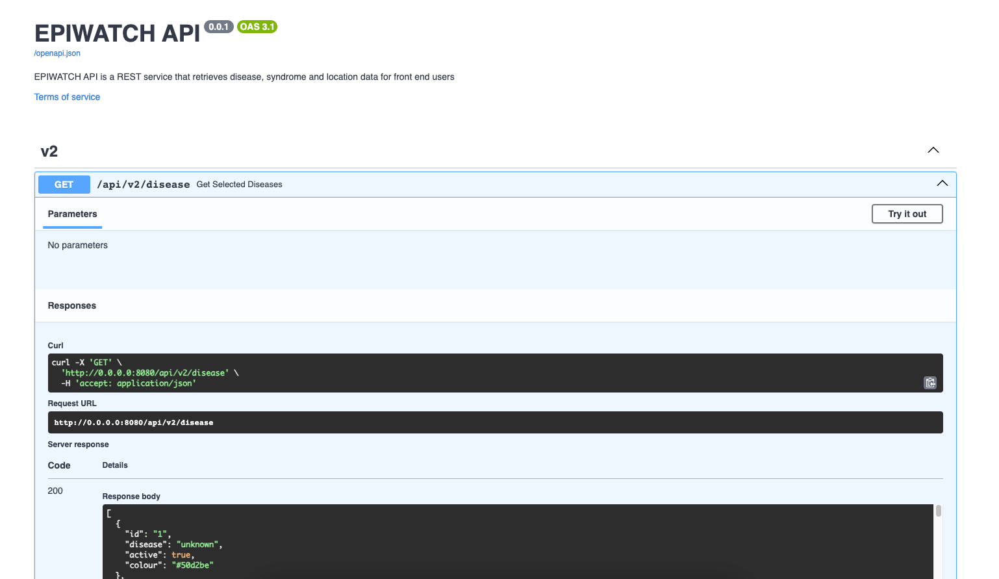

<!--
SPDX-FileCopyrightText: 2023 University of New South Wales <copyright@unsw.edu.au>
SPDX-License-Identifier: Apache-2.0
-->

<a name="readme-top"></a>

<br />
<div align="center">
  <a href="https://github.com/epiwatch/ews-dashboard/">
    
  </a>

<h3 align="center">EPIWATCH&reg; Open API</h3>

  <p align="center">
    EPIWATCH&reg; is an artificial intelligence-driven open-source outbreak observatory for early outbreak warnings (including infectious disease epidemics) and rapid risk analysis.
    <br />
    <br />
    Supported by the Balvi Filanthropic Fund's Shiba Inu Initiative, we'll be progressively open sourcing much of the codebase, starting with an <em>EPIWATCH Open Dashboard</em> project here. This code will be based on the <a href="https://www.epiwatch.org/reports">EPIWATCH Public Dashboard</a> (a managed service operated by the EPIWATCH Team at UNSW's Biosecurity Program).
    <br />
    <br />
  </p>
  <p>
    Copyright&copy; University of New South Wales.<br/><a href="https://www.epiwatch.org/">EPIWATCH&reg;</a> is a registered trademark of <a href="https://www.unsw.edu.au/">UNSW</a>.
  </p>
</div>


## Quick Links

* [Request Feature](https://github.com/epiwatch/ews-dashboard/issues)
* [Report Bugs](https://github.com/epiwatch/ews-dashboard/issues)
* [Report Security Issues](SECURITY.md)

<p align="right">(<a href="#readme-top">back to top</a>)</p>


<!-- ABOUT THE PROJECT -->
## About

EPIWATCH is the leading platform for rapid detection of emerging diseases signals from open source intelligence sources. The concept emerged in the wake of the 2015 West African Ebola epidemic, which demonstrated a critical gap in global capabilities for the early detection of emerging pandemics. EPIWATCH applies multiple AI technologies to fill this gap and enable rapid responses to exponential health threats, to prevent them from becoming widespread outbreaks and pandemics.

The EPIWATCH product has emerged from a research project at UNSW, led by Professor <a href="https://research.unsw.edu.au/people/professor-raina-macintyre">Raina MacIntyre</a> (Head of Biosecurity), a Eureka Award winner for her scientific leadership. In 2022, EPIWATCH received a significant donation from Vitalik Buterin's Balvi Filanthropic Fund. In 2022, the project won <a href="https://www.innovationaus.com/videos/innovationaus-awards-2022-highlights/">InnovationAus 2022 People's Choice Award</a>.

The code in this current open source repository, is our first public step towards building an open-source development community around detection of emerging infectious diseases of high consequence. We hope you'll join us in helping to build a healthier world.


<p align="right">(<a href="#readme-top">back to top</a>)</p>


## Features

This API open source project is a FastAPI application that allows the user to access endpoints that can query an EPIWATCH database. EPIWATCH Reports are structured information about open-source intelligence (OSINT) signals, e.g. highlighting a news media article about a potential infectious outbreak.

A variety of queries can be made to the EPIWATCH database including retrieving data involving disease, syndrome and location.

The API from this repo can either be used independently, with the EPIWATCH Open Public Dashboard project or as an external API for your own personal project.

<p align="right">(<a href="#readme-top">back to top</a>)</p>

## Installing / Getting Started

### Prerequisites

EPIWATCH is developed on latest Ubuntu and Fedora Linux LTS distributions, however it should work on other operating systems.

It requires the following to be pre-installed:

- Docker (latest LTS version, e.g. >=v24.0.6).
- PostgreSQL (latest LTS version, e.g. >=v13.12.0).

### Create PSQL database

* Checkout this project (or download and unpack the zip).
* Create psql database with the name "epiwatch_sample_db".
```sh
    CREATE DATABASE epiwatch_sample_db;
```
* Populate database with our sample_db.sql file.
```sh
    psql epiwatch_sample_db < sample_db.sql
```

### Create API's docker container

* Copy the .env-template file and in the same directory, create a new file called .env. The default settings are as follows:
```sh
    [DB]
    PSQL_SERVER="host.docker.internal"
    PSQL_PORT=5432
    PSQL_DB="epiwatch_sample_db"
    PSQL_USERNAME=""
    PSQL_PASSWORD=""
```
* Build the docker image from the Dockerfile.
```sh
    docker build -t epiwatch-api .
```
* Run the docker container. Replace the /path/to/logs and /path/to/data sections in the below code to the correct file paths for the logs and data folders.
```sh
    docker run -p 8080:8080 -v /path/to/logs:/code/app/logs -v /path/to/data:/code/app/data epiwatch-api
```

### Use

Open the api in a web browser by navigating to the docs of the configured listening endpoint, e.g., http://0.0.0.0:8080/docs by default.

The page should render approximately like this:


<br/>
From this docs page, you can learn more about the inputs required for each endpoint and test their outputs.

<p align="right">(<a href="#readme-top">back to top</a>)</p>

## Developing
### Setting up Development Environment

It's a pretty standard Node and Yarn setup, but later we'll be add details of a suggested development environment setup here (e.g. using VS Code, setting up plugins, etc.).


## Packaging / Deploying / Publishing

At the moment, this release supports local development use only (as above). Later we'll add details here of building and deploying the app in an OCI container for Docker or Podman.

<p align="right">(<a href="#readme-top">back to top</a>)</p>


## Roadmap

Following the API, we'll be releasing:
- Updates to the API to be paired with the Public Dashboard's features
- Internationalized Dashboard (adding major Indian languages support)

<br/>
<p align="right">(<a href="#readme-top">back to top</a>)</p>


## Contributing

Community contributions are welcome and greatly appreciated.

Please see [CONTRIBUTING.md](CONTRIBUTING.md) for information.</p>

<p align="right">(<a href="#readme-top">back to top</a>)</p>

### Open Tasks / Issues

The open source project is brand new and there's a lot yet to do, so please bear with us. Here's an incomplete list of what's open. If there's something you'd like to contribute on, please get in touch:

See [open issues](https://github.com/epiwatch/ews-api/issues) for a list of outstanding tasks, proposed features (and known issues).


<p align="right">(<a href="#readme-top">back to top</a>)</p>


## License

Please see [LICENSE](LICENSE) for licensing information. Most of this reposity is under *Apache Software License 2.0* (i.e. SPDX Id: "Apache-2.0").

<p align="right">(<a href="#readme-top">back to top</a>)</p>


## Contacts / Support

- Web form: [Contact Us (EPIWATCH Team)](https://www.epiwatch.org/contact)
- Twitter: [@epiwatch_bsp](https://twitter.com/epiwatch_bsp)
- Project:  [https://github.com/epiwatch/ews-api](https://github.com/epiwatch/ews-api)
- Website:  [https://epiwatch.org](https://epiwatch.org)

<p align="right">(<a href="#readme-top">back to top</a>)</p>


## Acknowledgments

### Supporters

The EPIWATCH Team gratefully acknowledges generous support of the Balvi Filanthropic Fund and Shiba Inu OSINT Initiative.


### Open Source Contributions

* othneildrew's [README Template](https://github.com/othneildrew/Best-README-Template/) (which this drew from)
* []() and many more... (See [NOTICES.md](NOTICES.md))

<p align="right">(<a href="#readme-top">back to top</a>)</p>